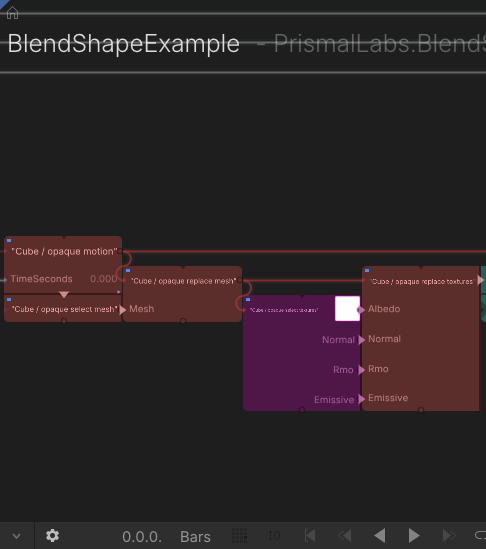
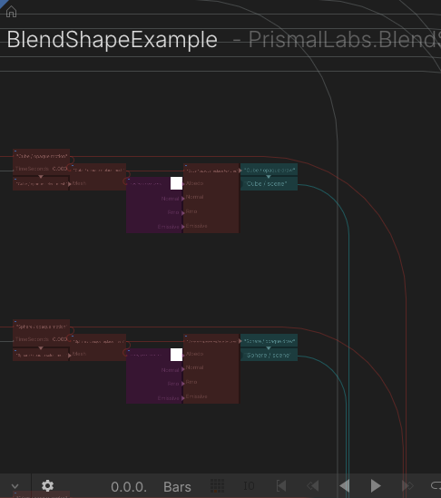

# Bridge reference

Blender owns the source scene. The bridge produces replaceable caches and installs them into a TiXL project whose home graph remains editable by the user.

## Data transferred from Blender

- Meshes, UV textures, and glTF-compatible PBR material properties.
- Object transforms, visibility, shape keys, material base color and emission, and lights sampled at 60 Hz.
- The active camera, lens and clipping data, plus camera-bound timeline markers for cuts.
- One generated import branch per configured world, with scene switching, rendering, and final resolution control.

Procedural Blender shaders, arbitrary World-node networks, and physical refraction are not guaranteed to match. Build TiXL-side equivalents when glTF cannot represent the source.

## Generated and editable ownership

The authored `.blend` stays in place. Generated data, logs, manifests, camera samples, animation caches, and the TiXL project link live in `.tixl_cache/<blend name>/` beside it. A generated TiXL project is created beside the configured operator project.

Sync replaces generated import data but preserves the user-owned project home, TimeClips, supported timing wires, editable mesh and texture routes, node positions, and render graph. If Blender adds or removes worlds, update the corresponding user-owned scene branches deliberately. Older home symbols replaced during migration are backed up under `project_backups/` in the cache.

## Home graph

The generated home has one row per world and a shared world switch and render chain:



Each world exposes animation, mesh, texture, and scene connections:



The default timing path is:

```text
Blender Source Clips
  ├─> global Clip Sequence ─> Camera Timeline ─> world selection
  └─> world Clip Sequence ─> World Clip Time ─> Animation Scene
```

Move or trim source TimeClips to change placement and sampled source time. Insert native TiXL float operators before or after **World Clip Time** to retime one world without changing camera cuts or other worlds.

For geometry, **Select mesh** feeds **Replace mesh**. Keep their zero-based `PrimitiveIndex` values aligned and insert native TiXL mesh operators between them. For materials, **Select textures** exposes albedo, normal, roughness/metal/occlusion, and emissive maps; process any map with TiXL image operators before its matching **Replace textures** input.

**Preload all Blender worlds** initializes scene and animation branches on the first paused evaluation. The light operator caches world manifests and channels. The selected world then feeds the camera, environment, render target, tone mapping, and **Output target**.

New homes use the grid and lane defaults in `blender_tixl_bridge/templates/home_layout.json`. Sync preserves positions rearranged in TiXL. Home graphs have an internal **Resolution** node and no symbol ports; the generated import symbol keeps its ports for reuse inside other graphs.

## Reusable TiXL operators

The bridge installs eleven shared operators under `PrismalLabs.BlenderExport`:

| Operator | Role |
| --- | --- |
| `BlenderSourceClip` | Editable source TimeClip. |
| `BlenderClipSequence` | Maps active source clips to source time. |
| `BlenderWorldClipTime` | Separates global camera time from per-world timing. |
| `BlenderCameraTimeline` | Samples the exported camera and selects the active world. |
| `BlenderAnimationScene` | Applies transform, visibility, material, and morph animation to glTF scenes. |
| `BlenderWorldPreload` | Warms every connected world before switching. |
| `BlenderExportLights` | Samples and applies exported Blender lights. |
| `BlenderMeshSelect` | Exposes one animated primitive's mesh buffers. |
| `BlenderMeshReplace` | Replaces that primitive after TiXL mesh processing. |
| `BlenderTextureSelect` | Exposes four material texture groups. |
| `BlenderTextureReplace` | Replaces processed material textures. |

## Package layout

- `blender_tixl_bridge/__init__.py` — Blender add-on, preferences, save handler, and operators.
- `blender_tixl_bridge/operators/` — reusable TiXL `.cs`, `.t3`, and `.t3ui` operators.
- `blender_tixl_bridge/source/` — export, validation, graph generation, installation, and debug client.
- `blender_tixl_bridge/templates/` — internal graph and layout templates; do not install them as a TiXL project.
- `build_addon_zip.py` — reproducible add-on package builder.
- `install_blender_addon.py` — verified checkout installer and preference migration.

The background exporter never runs during TiXL render frames. Generated cache publication waits for a safe paused frame when a debug connection is active.
