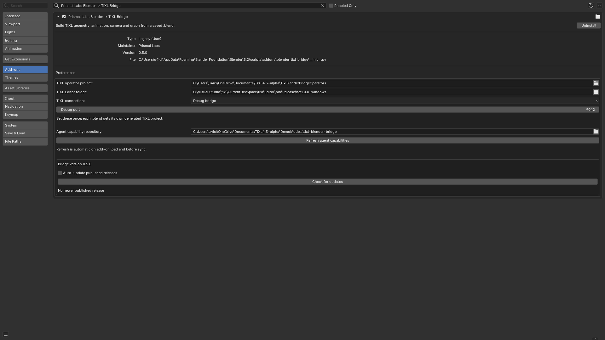
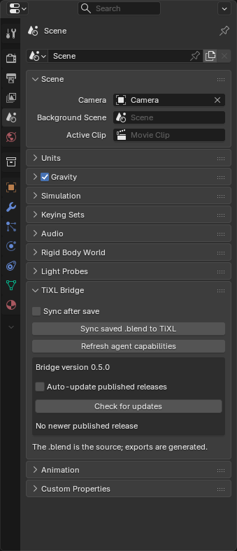

# Setup and usage guide

This guide covers the human installation and daily workflow for the Blender–TiXL bridge. You can use the add-on by itself or open the repository as an agent workspace; see [Agentic workspace workflow](AGENTIC_WORKFLOW.md) for that option. For graph structure and supported data, see the [bridge reference](BRIDGE_REFERENCE.md).

## Requirements

- Blender 4.3 or newer.
- The official Blender MCP extension, installed and enabled in Blender.
- A TiXL Editor build.
- The .NET SDK required by that TiXL build.
- A TiXL-created C# operator project containing a `.csproj`, `Symbols` directory, and valid release metadata.

The current bridge release is tested with Blender 5.2.2 LTS and TiXL 4.3.0.2.

## Complete application first-run setup

### Blender and Blender MCP

Launch Blender once and complete its first-run splash before installing the bridge. Install and enable the official Blender MCP extension through Blender's Extensions/Add-ons interface, then connect an MCP client and confirm it can read Blender state or execute a harmless Blender Python expression.

### TiXL

Launch TiXL once before configuring the bridge. Choose a short, stable username/root namespace when TiXL asks for one; it becomes part of project namespaces and is difficult to change later. Then create a dedicated operator project in TiXL rather than using its built-in `examples` project.

Keep the operator-project directory and the directory that directly contains `TiXL.exe`. You will enter both in Blender.

## Install the Blender add-on

Download `blender-tixl-bridge-<version>.zip` from the [latest GitHub release](https://github.com/H445/blender-tixl-bridge/releases/latest).

To build the same versioned package from a source checkout instead, run:

```powershell
python build_addon_zip.py
```

In Blender:

1. Open **Edit → Preferences → Add-ons**.
2. Choose **Install from Disk** and select `blender-tixl-bridge-<version>.zip`. Blender versions that use **Get Extensions** expose the same command there.
3. Enable **Prismal Labs Blender → TiXL Bridge**.
4. Set **TiXL operator project** to the dedicated project directory.
5. Set **TiXL Editor folder** to the directory containing `TiXL.exe`.
6. Leave **TiXL connection** on **Auto** unless you deliberately need another mode.



## Sync a scene

The `.blend` must be saved and must have either an active camera or camera-bound timeline markers.

1. Open **Scene Properties → TiXL Bridge**.
2. Click **Sync saved .blend to TiXL**, or enable **Sync after save** for continuing automatic builds.
3. Open `<blend folder>/.tixl_cache/<blend name>/sync_logs/sync_status.json` during the first build. Its active entry links to the current detailed log.

Repeated saves share one active sync per source file. While it runs, another save replaces the pending request with the latest saved revision. The Scene panel and `sync_logs/sync_status.json` report running, pending, completed, and error states. A failed job does not discard a newer pending save. Launch failures retry three times, then remain available for the next save or manual sync. Keep Blender open until pending work finishes.



The first sync installs the reusable operators, creates a TiXL project beside the operator project, and records its exact location in `.tixl_cache/<blend name>/tixl_project.json`. Later syncs replace generated imports while preserving the project home, TimeClips, editable mesh and texture routes, and render graph.

Daily use is simply: work in Blender and save. A failed export retains the previous validated cache. When installation requires TiXL to be closed, sync reports a manual handoff: save your editor work, close TiXL yourself, and retry sync. The bridge never closes or forcibly terminates a running editor. It can launch TiXL after a successful installation when no editor was running.

## Connection modes

| Mode | Best for | Behavior |
| --- | --- | --- |
| **Auto** | Most users | Uses the debug bridge when available and otherwise builds offline. |
| **Offline** | Normal release builds without a control socket | Writes and builds the project directly. Select a new generated project once in TiXL. |
| **Debug bridge** | Bridge and TiXL development | Refreshes unchanged graph data and code through the live protocol; graph structure changes require saving work, manually closing TiXL, and retrying sync. Activation checks the saved graph against loaded children and connections. |

For live development, start TiXL with `--debug-server 9042`, or select **Debug bridge** and let the bridge launch it on the first build. The port is configurable. The server listens only on the local computer and is not required for normal release use.

## Multi-world scenes

Without extra configuration, the active Blender scene becomes one TiXL world named `main`. For multiple worlds, add a Scene custom property named `tixl_worlds` containing JSON. Each entry needs a unique name, an existing collection, and a contiguous time range:

```json
[
  {"name":"cube","collection":"Cube","start_seconds":0,"end_seconds":4},
  {"name":"sphere","collection":"Sphere","start_seconds":4,"end_seconds":8},
  {"name":"prism","collection":"Prism","start_seconds":8,"end_seconds":12},
  {"name":"cylinder","collection":"Cylinder","start_seconds":12,"end_seconds":16}
]
```

Camera timeline markers can control cuts independently. See the bundled [BlendShapeExample](../examples/README.md), which morphs through these four worlds over a 16-second loop.

Set the optional `tixl_project_name` Scene property when the generated project needs an exact name. It must be a valid C# identifier and unused on the first sync.

## Update the add-on

The add-on checks the latest published bridge release once when Blender starts.
Open **Edit → Preferences → Add-ons → Prismal Labs Blender → TiXL Bridge** (or
**Scene Properties → TiXL Bridge**) to see the result and click **Check for
updates** again at any time. When a newer versioned ZIP is published, click
**Update to …** to download and install it. Enable **Auto-update published
releases** to install a newer release after the startup check; this is off by
default. The preference is saved immediately. Restart Blender when the panel
reports that installation finished. It never closes Blender or discards an
unsaved scene for you.

Updates come from the repository's published GitHub Releases, not untagged
commits. A release must have the matching versioned add-on ZIP. The add-on
checks the ZIP version and published size and verifies the published SHA-256
digest when GitHub provides one. It preserves Blender preferences and files
outside the packaged add-on. If Blender is running the add-on directly from a
source checkout, use the checkout installer below instead; the release updater
does not overwrite that checkout. Network or installation errors appear in the
panel, and **Check for updates** can retry them.

### Update from a checkout

Close Blender, then run:

```powershell
& "<path-to-blender.exe>" --background --python install_blender_addon.py
```

The installer copies and hashes the add-on, enables it, migrates the former `tixl_blender_bridge` module, preserves existing settings on updates, and saves preferences. Restart Blender afterward. Rebuild the distributable ZIP with `python build_addon_zip.py` whenever package files change; its filename is derived from `bl_info["version"]`.

## Command-line cache build

Set `TIXL_BRIDGE_BLENDER` to the Blender executable, then run:

```powershell
python blender_tixl_bridge/source/blend_sync.py sync --blend C:\path\scene.blend --no-install
```

`status --blend ...` checks whether the cache matches the saved file. `--force` rebuilds unchanged input. A full command-line install also uses `TIXL_BRIDGE_OPERATOR_PROJECT`, `TIXL_BRIDGE_EDITOR`, `TIXL_BRIDGE_MODE`, and `TIXL_BRIDGE_PORT`. Set `TIXL_BRIDGE_LAUNCH_EDITOR=0` to build without starting TiXL.

## Generated storage and recovery

`sync_logs/latest_run.json` summarizes the last completed sync or explicit install. It links to metrics, the detailed sync log when launched from Blender, and the export log when available. `last_successful_run.json` and `failed_run.json` retain the latest successful and failed evidence separately. `latest.log` is a compatibility copy of the most recently completed Blender-launched sync log; use the status file to follow an active run.

Detailed logs keep up to 4 MiB each. Larger output retains the beginning and latest tail with an explicit omitted-byte marker. The matching `.meta.json` records output and omitted bytes. Small logs remain complete. Export success is checked while reading the full output, before trimming.

Retention runs at the end of a serialized sync or install. Defaults retain up to three export generations (1 GiB), ten owned project backups (256 MiB), two owned failed/incomplete stages (512 MiB), eighty metrics files (16 MiB), and twenty sync-log/metadata files (64 MiB). Maximum age is 30 days, or seven days for stages. Protected recovery evidence takes precedence over these budgets. `sync_logs/retention.json` reports removals, deferrals, and excess caused by protected entries.

The active and previous committed generations, latest failed evidence, saved graph references, retained backup references, and the newest entry remain protected. Generation deletion defers while TiXL is open because unsaved graphs and undo history can reference old data. After saving editor work and closing TiXL, the next sync applies the policy. Missing or malformed recovery evidence, unreadable graph directories, and linked/reparse paths defer cleanup. Legacy unmarked backup and staging folders remain untouched.

To adjust limits, create `retention_policy.json` in the scene's cache directory. Omitted categories keep their defaults; each supplied category accepts `max_count`, `max_bytes`, and `max_age_days`. For example:

```json
{
  "generations": {"max_count": 5, "max_bytes": 2147483648, "max_age_days": 60},
  "backups": {"max_count": 20, "max_bytes": 536870912, "max_age_days": 60},
  "max_log_bytes": 8388608,
  "protected_generations": []
}
```

`max_log_bytes` must be at least 1024. Add generation IDs to `protected_generations` before copying graph references to another project or using cache data outside the recorded project. Those external uses cannot be discovered automatically. Invalid policy values defer cleanup without changing the sync result.

For recovery, save and close TiXL first. Inspect the failed summary and the corresponding owned backup under `project_backups/`; copy needed saved graph files back into the recorded project only after preserving its current files. Do not edit committed generation payloads. An incomplete active cache automatically falls back to the previous committed generation; a fresh sync can rebuild it from the authored `.blend`.

## Troubleshooting

- Start with `.tixl_cache/<blend name>/sync_logs/latest_run.json`, or `sync_status.json` while a job is active. Follow their detailed log links for missing cameras, missing collections, and invalid project metadata.
- In Offline mode, select a newly generated project once in TiXL.
- If TiXL opens while transport is running, pause once so the project can preload every world.
- If a bridge update changes loaded `.t3` or `.t3ui` structure, save editor work and restart TiXL. `reload` can leave the old graph in memory.
- If TiXL is open without the debug bridge, save your editor work and close it manually before publishing changed cache files. Retry sync afterward; the bridge will not close it for you.
- On a manual ZIP update, disable the former add-on before enabling the new package and transfer its preferences.
